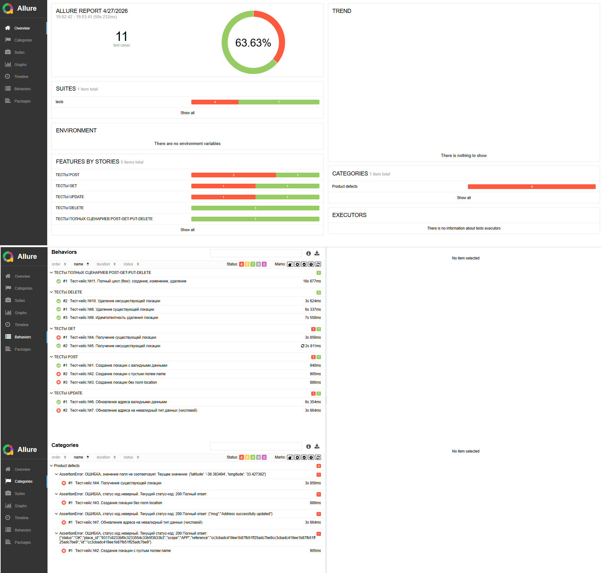

## Содержание

- [О проекте](#о-проекте)
- [Результаты тестирования](#результаты-тестирования)
- [Структура проекта](#структура-проекта)
- [Установка и запуск тестов](#установка-и-запуск-тестов)
- [Примечания](#примечания)
- [Об авторе](#об-авторе)

---

# О проекте

Ссылка на репозиторий со всеми проектами, резюме и информацией обо мне: https://github.com/ekburenkova/portfolio-qa-projects

Данный проект представляет собой набор автотестов для тестирования Google Maps API (учебный сервис rahulshettyacademy.com).

### Цель проекта
Проверка корректности работы API для операций создания, получения, обновления и удаления локаций (CRUD).

### Задачи проекта

- Написание автотестов для API с использованием Python и pytest
- Проверка позитивных и негативных сценариев
- Валидация структуры и содержимого ответов API
- Проверка бизнес-логики (создание → изменение → удаление)
- Обнаружение и документирование багов
- Формирование отчётов с помощью Allure

### Архитектурный подход

Проект реализован с разделением ответственности:
- тесты содержат только сценарии
- API-логика вынесена в отдельный слой
- проверки реализованы в переиспользуемых методах

Это позволяет:
- уменьшить дублирование кода
- упростить поддержку тестов
- повысить читаемость проекта

---

# Результаты тестирования

В рамках проекта было реализовано и выполнено:

- Всего тестов: 11
- Успешно пройдено: 7
- Провалено: 4

Проваленные тесты связаны с дефектами API и описаны в файле [BUGS.md](./BUGS.md).

### Отчёт Allure

Ниже представлен пример отчёта Allure по результатам выполнения тестов:




---

# Структура проекта

Проект построен по модульному принципу с разделением логики тестов, API-запросов и вспомогательных функций.

### tests/

Содержит тесты, сгруппированные по HTTP-методам:

- `test_create_place.py` — тесты для создания локации (POST)
- `test_get_place.py` — тесты для получения данных (GET)
- `test_update_place.py` — тесты для обновления данных (PUT)
- `test_delete_place.py` — тесты для удаления (DELETE)
- `test_scenarios.py` — сценарный тест полного цикла (CRUD)

### utils/

Содержит вспомогательные модули:

- `api.py` — формирование запросов и работа с API
- `httpmethods.py` — реализация HTTP методов (GET, POST, PUT, DELETE)
- `checking.py` — универсальные методы для проверок ответов API
- `logger.py` — логирование запросов и ответов

### conftest.py

Содержит фикстуры pytest, используемые в тестах (например, создание тестовой локации).

### logs/

Логи выполнения тестов (запросы, ответы, статусы).

### allure-results / allure-report/

Результаты тестов и отчёты Allure.

### TESTCASES.md

Документ с описанием тест-кейсов.

### BUGS.md

Документ с найденными багами.

### requirements.txt

Список зависимостей проекта.

---

# Установка и запуск тестов

## Установка Python
Выполняйте, если на вашем компьютере не установлен интерпретатор Python.

1. Перейдите на официальный сайт: [https://www.python.org/downloads/](https://www.python.org/downloads/)
2. Скачайте последнюю версию Python
3. При установке обязательно поставьте галочку: `Add Python to PATH`
4. Скачайте проект. Для этого на GitHub нажмите кнопку "Code" → "Download ZIP"
5. Распакуйте архив на компьютере в удобное место и откройте папку проекта
6. В адресной строке проводника введите `cmd`, чтобы открыть командную строку
7. Создайте виртуальное окружение. Для этого в терминале введите команду (после ввода каждой команды
нажимайте `Enter`/`Ввод`): 
```bash 
python -m venv .venv
```
8. Активируйте виртуальное окружение командой:
```bash
.venv\Scripts\activate
```
9. Установите зависимости командой:
```bash
pip install -r requirements.txt
```

## Запуск тестов и просмотр отчёта Allure
Выполняйте команды в терминале Windows с настроенным окружением (см. "Установка Python"), либо
в удобном интерпретаторе Python. Вы можете запустить тесты без отчёта Allure, тогда все результаты отобразятся
в командной строке компьютера. Для запуска отчета Allure потребуется дополнительно установить его на ваш
компьютер.

### Запуск тестов без отчёта Allure
Выполните одну из команд ниже.
Для подробного вывода информации по тестам:
```bash
pytest -v --capture=tee-sys
```
Для краткого вывода (название теста + результат):
```bash
pytest -v
```
Ознакомьтесь с результатами. Каждый тест по итогам выполнения выдает статус `PASSED` (прошел успешно)
или `FAILED` (неуспешно).

### Запуск тестов с отчётом Allure

1. Скачайте Allure:
   [https://github.com/allure-framework/allure2/releases](https://github.com/allure-framework/allure2/releases)
2. Распакуйте архив и скопируйте путь, куда скопирована папка с программой.
3. Запустите тесты. Введите команду в командную строку:
```bash
pytest -v --alluredir=allure-results
```
5. Запустите показ отчета Allure командой:
```bash
ПУТЬ К ПАПКЕ В ФОРМАТЕ "C:\allure\allure-2.xx.x\bin\allure" serve allure-results
```
После выполнения откроется браузер с визуализацией отчета и подробной информацией по тестам.

---

# Примечания

1. Тесты выполняются на общем тестовом сервере. Из-за этого иногда могут возникать ошибки (например, статус-код 500), связанные с нагрузкой, а не с самими тестами.
2. Все найденные баги (не соответствие ожидаемого результата фактическому) описаны в файле: BUGS.md. 

   


